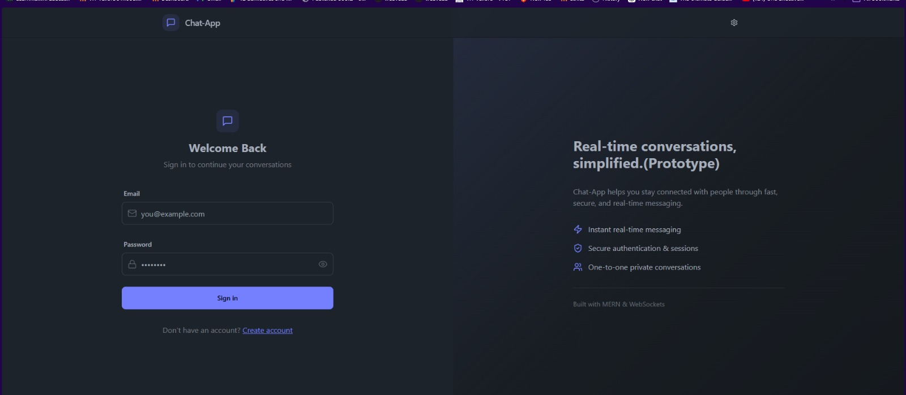
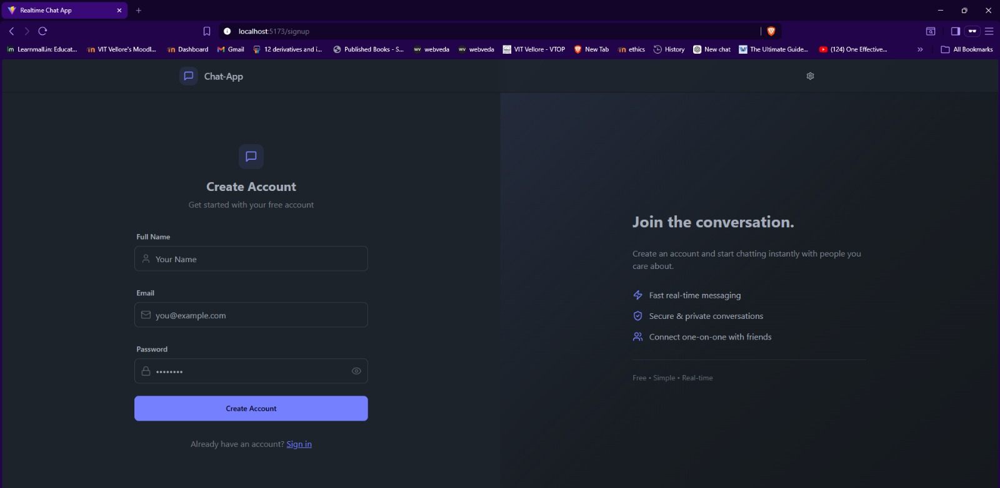
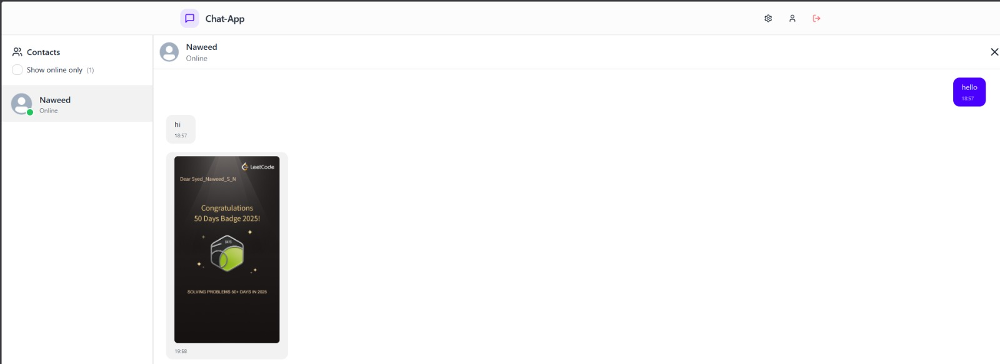
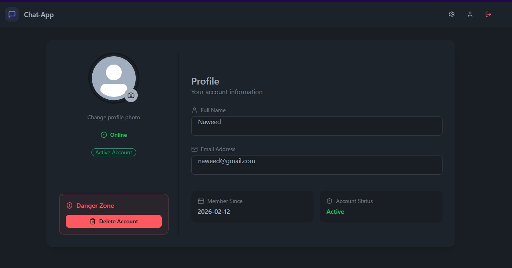
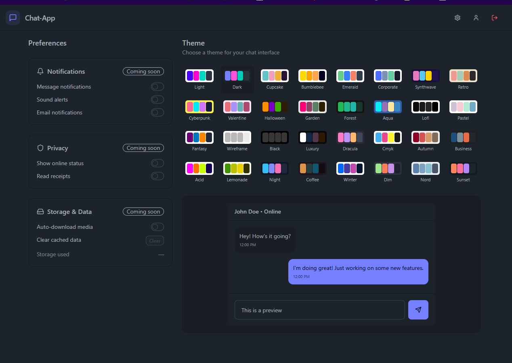

# 💬 Chat-App – Real-Time Messaging Application

A full-stack real-time chat application with authentication, image sharing, and persistent message history.

---

## 🚀 Features

- 🔐 User Authentication (Signup / Login / Logout)
- 💬 Real-time messaging using Socket.IO
- 🖼️ Image sharing via Cloudinary
- 🧠 Persistent chat history (MongoDB)
- 🎨 Multiple UI themes
- 👤 Profile management
- 📱 Fully responsive design

---

## 🛠️ Tech Stack

### Frontend

- React + Vite
- Tailwind CSS + DaisyUI
- Zustand (state management)
- Axios

### Backend

- Node.js
- Express.js
- MongoDB + Mongoose
- Socket.IO
- Cloudinary
- JWT Authentication

---

## ⚙️ Environment Variables

### Backend (`/backend/.env`)

```js
PORT = 5001;
MONGODB_URI = your_mongodb_uri;
JWT_SECRET = your_jwt_secret;

CLOUDINARY_CLOUD_NAME = your_cloud_name;
CLOUDINARY_API_KEY = your_api_key;
CLOUDINARY_API_SECRET = your_api_secret;
```

### Frontend (`/frontend/.env`)

```js
VITE_API_BASE_URL=http://localhost:5001/api
```

---

### 3️⃣ Add **Run instructions** (short & clean)

---

## ▶️ Running the Project Locally

```bash
# Backend
cd backend
npm install
npm run dev

# Frontend
cd frontend
npm install
npm run dev
```

---

## 📸 Screenshots

### 🔐 Sign In



### 📝 Sign Up



### 💬 Chat Interface


### ↩️ Real-time Messaging



### 👤 Profile Page



### ⚙️ Settings & Themes



---

---

## 👨‍💻 Author

Built and maintained by **Naweed**  
B.Tech (Information Technology), VIT Vellore

This project was developed as part of a software developer internship assignment, focusing on real-time systems, authentication, and modern UI design.
